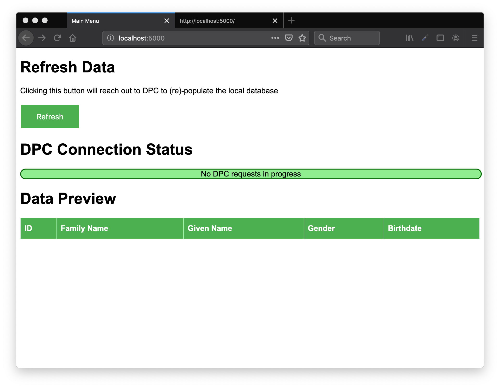
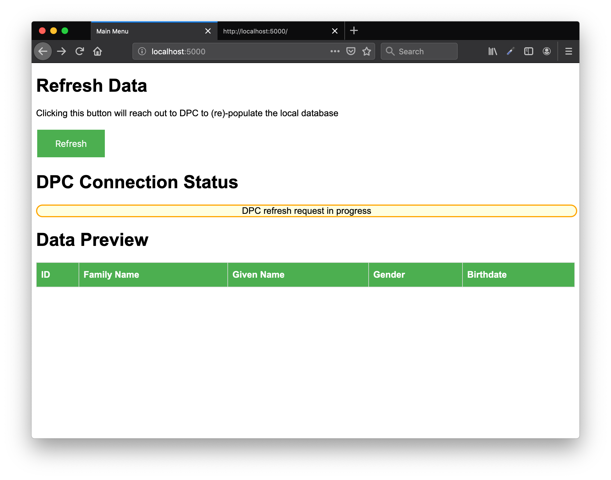
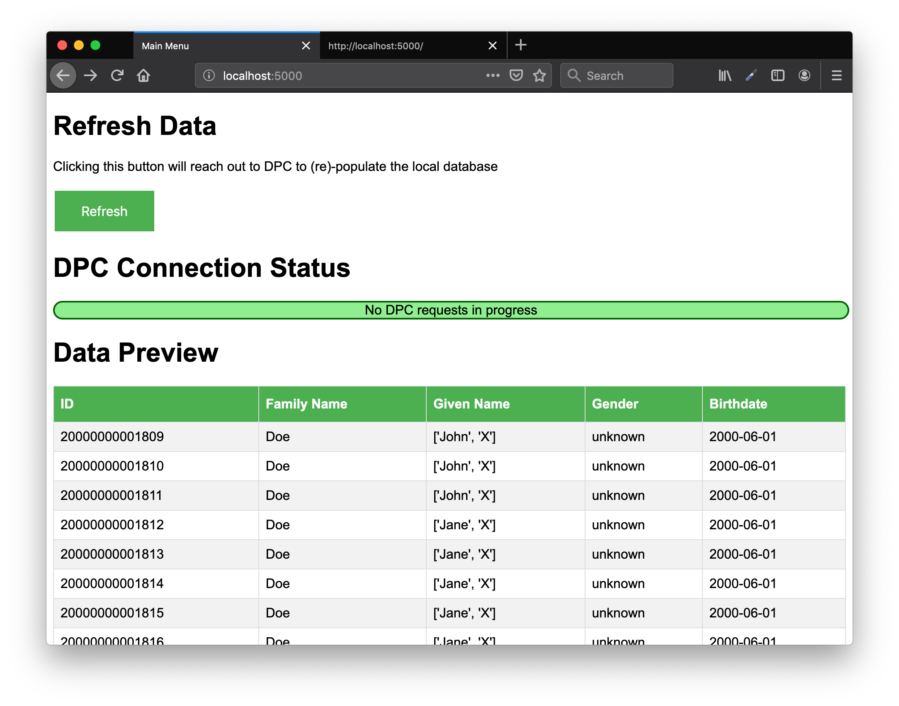

# DPC Example Frontend (Flask)

This project demonstrates how an application might interact with the DPC service to retrieve medicare data.

For more information about DPC, see https://github.com/CMSgov/dpc-app

## DPC Setup

DPC can be built and run locally on any machine with access to maven build tools (Java 11) and docker/docker-compose. After the build and initial docker-compose run, the database must be seeded with demo data.

```bash
# clone
git clone https://github.com/cmsgov/dpc-app
cd dpc-app

# build
docker-compose up --detach redis db
mvn clean package

# run
docker-compose up --detach

# seed
java -jar dpc-api/target/dpc-api-0.3.0-SNAPSHOT.jar demo
```

Of course, if a sandbox environment is already available, running locally is no longer necessary. To use a non-local instance of DPC, configure `DPC_URL` and `PROVIDER_ID` variables in `main.py`.

## Flask Demo Setup

For setup, it's recommended to create a dedicated python3 virtual environment like so:

```bash
git clone https://github.com/isears/dpc-flask-example/
cd dpc-flask-example/
python3 -m venv venv
. venv/bin/activate
pip install -r requirements.txt
```

## Run

Run within the same venv that was created during setup.
```bash
export FLASK_APP=main.py
python -m flask run
```

The initial state of the demo has no data and no DPC requests in progress



After hitting the "Refresh" button, the demo will reach out to the configured DPC server and request a bulk transfer of patient data



Once the request has finished (it may take some time), a sample of the data fetched from the DPC server will be displayed in the Data Preview section

